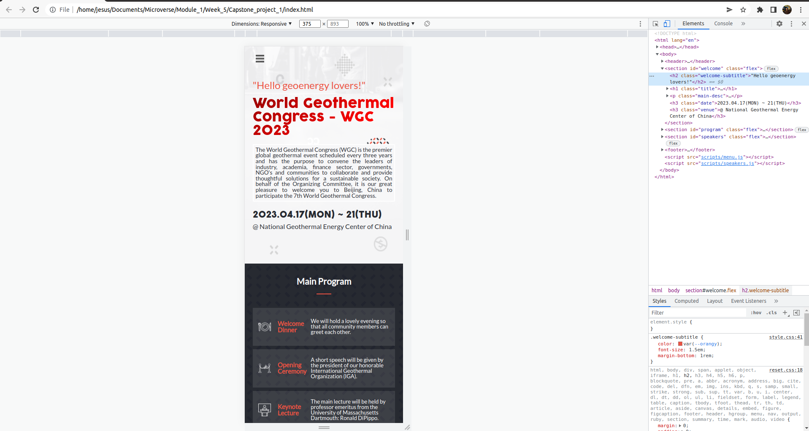
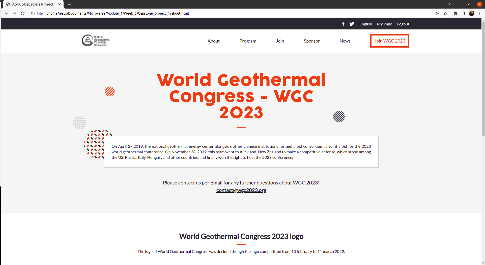

# HTML/CSS & JavaScript Capstone Project

> We built an entire website from scratch containing two pages: the "home" and "about" pages. We based the design on a template provided by Creative Commons. Here we applied what we have learned in Module 1 of Microverse. Up to now, we implemented the mobile and desktop versions of this tiny website; also we added a dynamic menu for the mobile version and created dynamically one section of the main page using JavaScript. This will be part of the Portfolio projects that will be shown to recruiters.

 

 

## Built With

- HTML, CSS and JavaScript.
- GitHub

## Live Demo (if available)

[Live Demo Link](https://jevazquezb.github.io/Capstone_project_1/)

## Project documentation (if available)

(Not available)

## Getting Started

**This will be included in our portfolio**

To get a local copy up and running follow these simple example steps.

### Step 1:

Go to the repo (https://github.com/jevazquezb/Capstone_project_1) and click on the <>Code tab.

### Step 2:

Below the <>Code tab, it will be a button that allows you to choose any of the branches of the repository you're interested in (it is commonly set by default to the "master" or "main" branch). Each branch may contain different files and changes to the repo. If you are not sure which one to choose, select the "master" branch.

### Step 3:

Go and click on the right green button with the "code" tag. Be sure to copy any of the https or the SSH links.

### Step 4:

Open the terminal in your computer. To do that, you need to type in the search bar "cmd" for Windows or "terminal" if you are using Línux or macOS.

### Step 5:

Go to the directory where you want to "pull" (download) the repo. If it doesn't exist, create it. Example: cd Documents/Microverse/Module_1/. You can create a folder manually and then go to it in the terminal using the cd command.

### Step 6:

Once you get into your directory, type in the terminal: git clone https or git clone SSH, and then press enter. Example: git clone git@github.com:jevazquezb/Capstone_project_1.git

### Step 7:

Ready to work?⛏️ You're all set to explore and change the repo locally (on your computer).

## Authors

👤 **Jesús Vázquez**

- GitHub: [@jevazquezb](https://github.com/jevazquezb)
- Twitter: [@javb_1187](https://twitter.com/javb_1187)
- LinkedIn: [LinkedIn](https://www.linkedin.com/in/jevazquezb)

## 🤝 Contributing

Contributions, issues, and feature requests are welcome!

Feel free to check the [issues page](https://github.com/jevazquezb/Capstone_project_1/issues).

## Show your support

Give a ⭐️ if you like this project!

## Acknowledgments

- To my Microverse coding partner Arnaud Bandonkeye (Github: [@B77748](https://github.com/B77748)) 🤜.
- Inspiration.
- etc.

## Credit

Original design idea by [Cindy Shin in Behance](https://www.behance.net/adagio07).

## 📝 License

This project is [MIT](./MIT.md) licensed.

© Creative Commons Korea 2023. 
